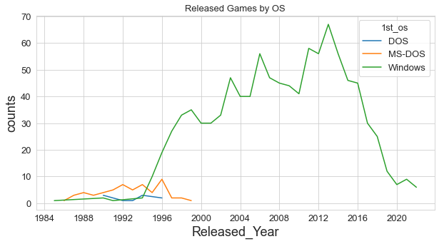

# Data_Analysis_Projects

- 데이터 분석 `토이 프로젝트`와 `프로젝트` 모두를 정리한 레포지토리입니다.

## computer_game `toy`
- [캐글의 컴퓨터 게임 데이터셋](https://www.kaggle.com/datasets/iamsouravbanerjee/computer-games-dataset)을 `pandas`를 이용해 살펴봤습니다.  

  

세부 내용

목적) `python`을 리마인드하려는 목적이 강했습니다.  

분석) 
- 분석 결과에서 특기할만한 점이라면, 95년 이후로는 `Windows` OS로 출시되는 게임이 기하급수적으로 증가했다는 점이 있겠습니다.

- <b>데이터를 신뢰한다는 전제</b> 하에서, 1995년에 `Windows 95`가 출시되었으며 이것이 게임사들에게 **플랫폼 이동 & 출시 게임 수 증가**를 불러왔다고 볼 수도 있겠습니다.
- DOS 게임은 00년대 이후로는 완전히 출시되지 않았습니다. 이는 OS 세대 전환이 완전히 이뤄졌다고 봐도 될 것입니다.
- 그러나 100% 확실하다고 볼 수는 없습니다. `DOS`의 모든 게임이 테이블에 들어가 있는지 어떤지는 알 수 없기 때문입니다. 예를 들면 이 테이블은 2022년의 정보까지 들어가 있지만 `파크라이 5, 6`에 대한 정보는 없습니다. 

  

## Kaggle_2022Derby `?? ~ 221111`
- [Kaggle - Big Data derby 2022](https://www.kaggle.com/competitions/big-data-derby-2022)에 참여했던 내용입니다.
- `Pandas`를 이용했습니다.

## Dacon_SoccerPlayerProspect `221114 ~ 221124`
- [데이콘 Basic : 축구 선수의 유망 여부](https://dacon.io/competitions/official/236031/overview/description)에 참여한 내용입니다.
- `Pandas, sklearn, keras` 등을 이용했습니다.
- 피쳐 엔지니어링을 더 봐야겠다!

